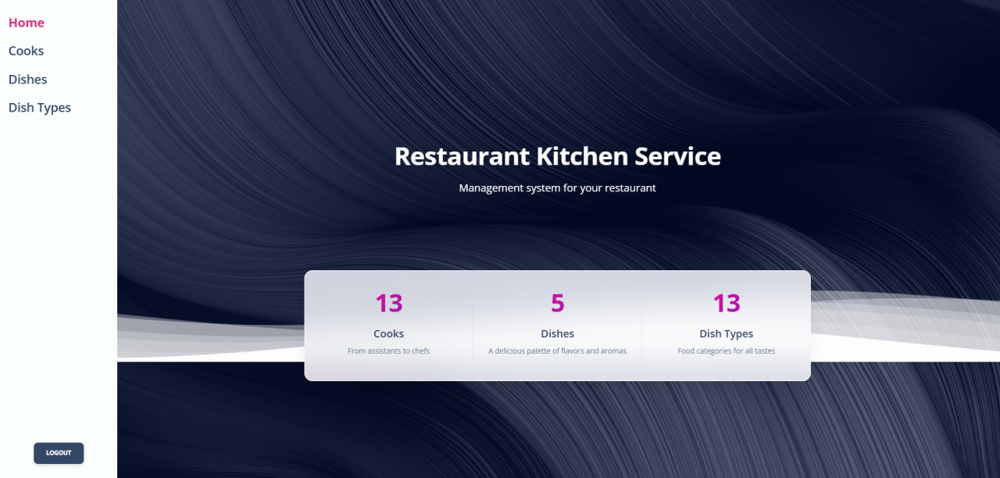
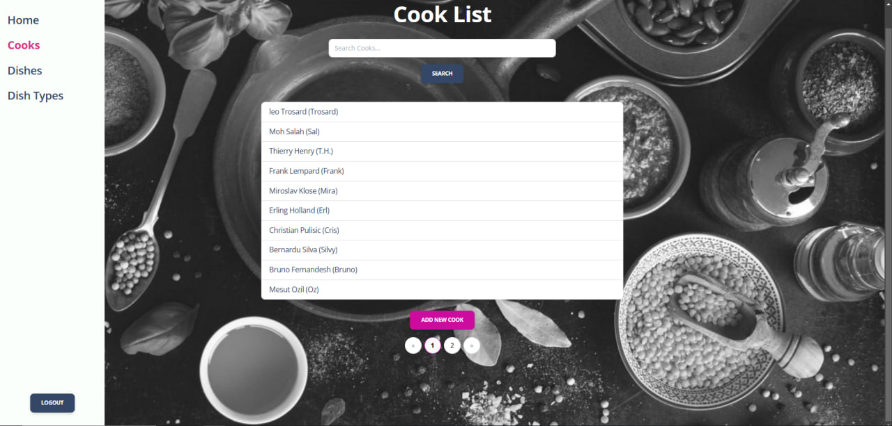
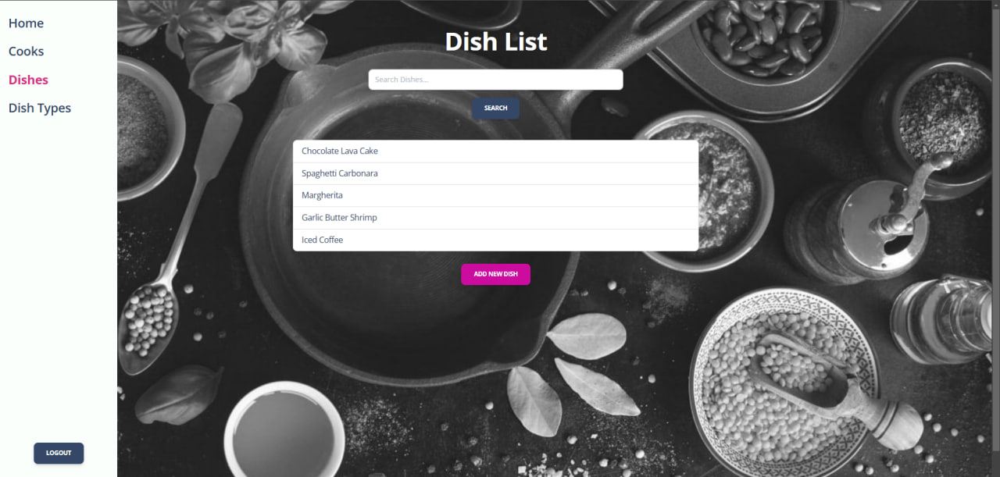
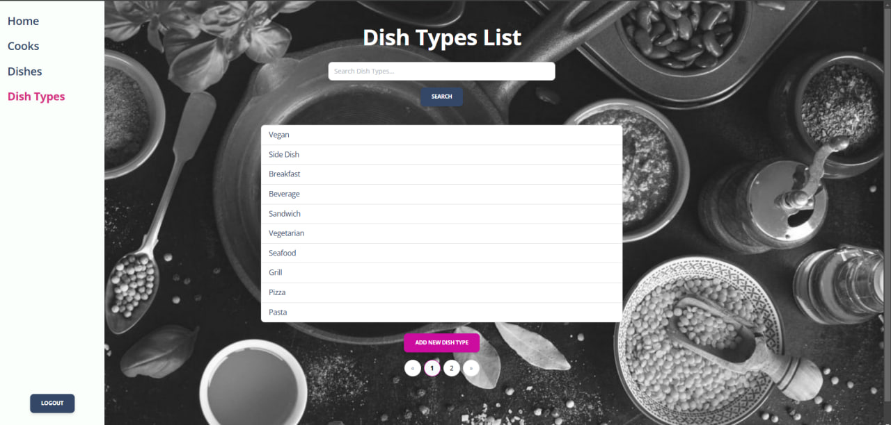
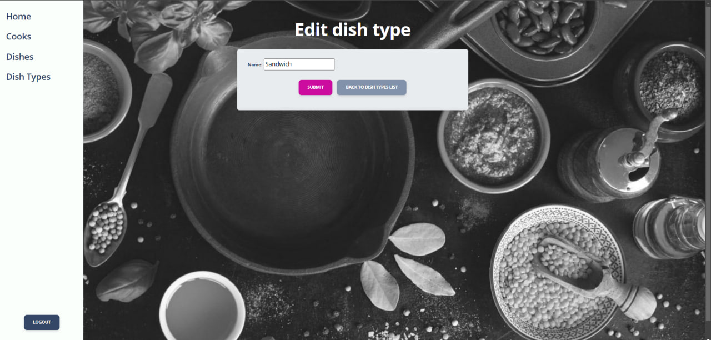

# Restaurant Kitchen Service

This project is intended for restaurant kitchen management. It allows you to add, edit and delete chefs, dishes and dish types.

## Project on Render.com : https://restaurant-kitchen-service-ssxb.onrender.com/
#Login: testuser
#Password: testpass

---
## Features

- **Cooks**
  - Add, edit, and delete cooks.
  - Display a list of all cooks with the ability to search by first name or last name.
  - View detailed information about a cook.

- **Dishes**
  - Add, edit, and delete dishes.
  - Display a list of dishes with the ability to search by name or dish type.
  - View detailed information about a dish.

- **Dish Types**
  - Add, edit, and delete dish types.
  - View a list of available dish types.

- **Homepage**
  - Statistics on the number of cooks, dishes, and dish types.
  - Visitor counter.

- **UI/UX**
  - Modern and user-friendly interface.
  - Pagination for pages to make it easier to view large numbers of records.

### Home Page

### Login Form

### Search Form

### Cook Details

### Cooks List

### Dishes List

### Dish Types List

### Edit Form

### Delete Confirmation Form

---

### How to Run the Project

- **git clone https://github.com/r0manvynnytskyi/restaurant_kitchen_service.git**
- **cd restaurant_kitchen_service**
- **pip install -r requirements.txt**
- **python manage.py makemigrations**
- **python manage.py migrate**
- **python manage.py runserver**
- **Open http://127.0.0.1:8000 in your browser.**
  #use this to enter:
- - Login: testuser
- Password: testpass
